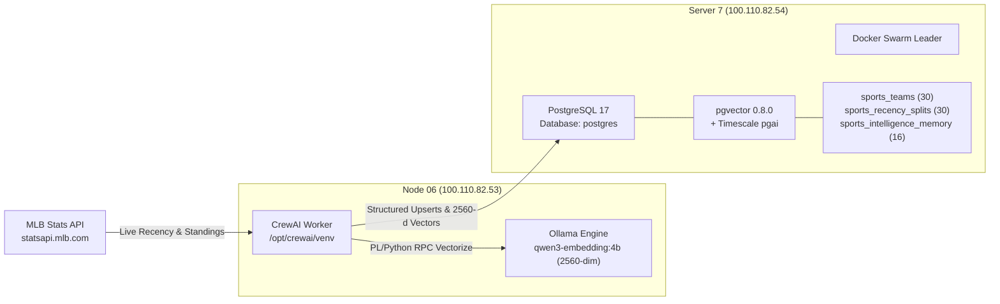

# Polymarket Intelligence & Edge Infrastructure Handover

**Timestamp:** 2026-09-16 05:39 EDT  
**Conversation ID:** `dc80ef94-8977-4973-a319-165f0d90842d`  
**Workspace Root:** [`/mnt/usb/polymarket-intelligence`](file:///mnt/usb/polymarket-intelligence)

---

## 1. Executive Summary of Accomplishments

| Domain | Status | Key Deliverable |
| :--- | :---: | :--- |
| **Docker Swarm Cluster** | 🟢 **Active Leader** | Server 7 (`100.110.82.54`) initialized as primary Swarm Manager & Leader. Join tokens generated for workers and secondary managers. |
| **Docker MCP Gateway** | 🟢 **Resolved** | Fixed tool name collision between `dockerhub` and `duckduckgo` (`tool-name-prefix` enabled). Granted volume binding permissions for Windows workspace. Dry run verified clean in 7.9s. |
| **VS Code MCP Bridge** | 🟢 **Integrated** | Installed extension [`YuTengjing.vscode-mcp-bridge`](https://github.com/tjx666/vscode-mcp.git) v4.9.5 in Antigravity IDE and VS Code. Configured `@vscode-mcp/vscode-mcp-server` globally in [`mcp.json`](file:///mnt/c/Users/d_ada.BRICE-HP/AppData/Roaming/Antigravity%20IDE/User/mcp.json). |
| **Sports Recency Pipeline** | 🟢 **Ingested** | Automated CrewAI + Timescale `pgai` pipeline ingested all 30 MLB teams, computed 3-5 game recency momentum splits, and generated 2560-dimension vector memories on Node 06 saved to Server 7. |
| **Edge Domain & Security** | 🟢 **Protected** | `https://weather.complexsimplicity-ai.com` live with Let's Encrypt TLS. Polymarket trading endpoints blocked (HTTP 403), auto-trade disabled, zero live wallet keys on public servers. |

---

## 2. Docker Swarm Infrastructure

Server 7 (`debian-4cpu-8gb-us-chi7`) has been promoted to **Docker Swarm Leader** on the secure Tailscale mesh interface (`100.110.82.54`).

```text
ID                            HOSTNAME                  STATUS    AVAILABILITY   MANAGER STATUS   ENGINE VERSION
5txy98109x6xtbefqdusymqz7 *   debian-4cpu-8gb-us-chi7   Ready     Active         Leader           29.8.1
```

### Joining Nodes to the Swarm

To join additional nodes (e.g. Node 06, Windows workstation, or secondary VPS nodes) over Tailscale:

* **Add as Worker:**
  ```bash
  docker swarm join --token SWMTKN-1-66h2v7eyqiw5800sxgfti1obcu1t5k8uwo6yhzjy6sntimupsk-8v4lv7w52c4pki2oz97i0m8iq 100.110.82.54:2377
  ```

* **Add as Secondary Manager:**
  ```bash
  docker swarm join --token SWMTKN-1-66h2v7eyqiw5800sxgfti1obcu1t5k8uwo6yhzjy6sntimupsk-08do1volag2ids5qelsq5xa4t 100.110.82.54:2377
  ```

> [!NOTE]
> Server 7's UFW firewall allows all traffic across the `tailscale0` virtual adapter (`100.64.0.0/10`), meaning Swarm control plane ports (`2377/tcp`, `7946/tcp+udp`, `4789/udp`) are fully operational between mesh nodes while completely blocked from the public WAN (`152.44.40.120`).

---

## 3. Docker MCP & Antigravity IDE Integration

### Root Causes & Fixes Applied

1. **Tool Name Collision (`search` on `dockerhub` and `duckduckgo`)**:
   * **Cause:** Multiple enabled MCP servers exposed identical tool names, aborting the gateway initialization.
   * **Fix:** Ran `docker mcp feature enable tool-name-prefix` on the Windows host. Tool names are now automatically prefixed (e.g., `dockerhub:search`, `duckduckgo:search`), eliminating collisions.
2. **Git Unsafe Volume Path Validation**:
   * **Cause:** Docker MCP rejected mounting `C:/Users/d_ada.BRICE-HP` because it was outside default temporary roots.
   * **Fix:** Injected `MCP_GATEWAY_DOCKER_BIND_ALLOW_WRITABLE_PATHS="C:/Users/d_ada.BRICE-HP,C:/"` and `MCP_GATEWAY_DOCKER_BIND_ALLOWED_PATHS="C:/Users/d_ada.BRICE-HP,C:/"` into the environment block of [`mcp.json`](file:///mnt/c/Users/d_ada.BRICE-HP/AppData/Roaming/Antigravity%20IDE/User/mcp.json).
3. **Executable Path**:
   * **Configured:** `C:\Users\d_ada.BRICE-HP\AppData\Local\Programs\DockerDesktop\resources\bin\docker.exe`.

### VSCode MCP Bridge ([`tjx666/vscode-mcp`](https://github.com/tjx666/vscode-mcp.git))

* **Extension Installed:** `yutengjing.vscode-mcp-bridge` (v4.9.5) installed into Antigravity IDE at `C:\Users\d_ada.BRICE-HP\.antigravity-ide\extensions\yutengjing.vscode-mcp-bridge-4.9.5-universal` and Microsoft VS Code.
* **Server Package Installed:** `@vscode-mcp/vscode-mcp-server` installed globally via npm on Windows and WSL.
* **Capabilities Exposed to AI:** Real-time LSP diagnostics (`get_diagnostics`), symbol info and hover signatures (`get_symbol_lsp_info`), cross-file references (`get_references`), workspace navigation (`list_workspaces`, `open_files`), and refactoring (`rename_symbol`).

### Active Configuration: [`C:\Users\d_ada.BRICE-HP\AppData\Roaming\Antigravity IDE\User\mcp.json`](file:///mnt/c/Users/d_ada.BRICE-HP/AppData/Roaming/Antigravity%20IDE/User/mcp.json)

```json
{
  "servers": {
    "MCP_DOCKER": {
      "command": "C:\\Users\\d_ada.BRICE-HP\\AppData\\Local\\Programs\\DockerDesktop\\resources\\bin\\docker.exe",
      "args": ["mcp", "gateway", "run", "--profile", "default"],
      "env": {
        "MCP_GATEWAY_DOCKER_BIND_ALLOW_WRITABLE_PATHS": "C:/Users/d_ada.BRICE-HP,C:/",
        "MCP_GATEWAY_DOCKER_BIND_ALLOWED_PATHS": "C:/Users/d_ada.BRICE-HP,C:/",
        "LOCALAPPDATA": "C:\\Users\\d_ada.BRICE-HP\\AppData\\Local",
        "ProgramData": "C:\\ProgramData",
        "ProgramFiles": "C:\\Program Files",
        "PATH": "C:\\Users\\d_ada.BRICE-HP\\AppData\\Local\\Programs\\DockerDesktop\\resources\\bin;C:\\Program Files\\nodejs;C:\\Users\\d_ada.BRICE-HP\\AppData\\Roaming\\npm;C:\\Windows\\system32;C:\\Windows"
      },
      "type": "stdio"
    },
    "vscode-mcp": {
      "command": "C:\\Program Files\\nodejs\\node.exe",
      "args": [
        "C:\\Users\\d_ada.BRICE-HP\\AppData\\Roaming\\npm\\node_modules\\@vscode-mcp\\vscode-mcp-server\\dist\\index.js"
      ],
      "env": {
        "PATH": "C:\\Program Files\\nodejs;C:\\Users\\d_ada.BRICE-HP\\AppData\\Roaming\\npm;C:\\Windows\\system32;C:\\Windows"
      },
      "type": "stdio"
    }
  },
  "inputs": []
}
```

---

## 4. Distributed Sports Data & Vector Intelligence Pipeline

### Architecture Overview



### Database Schema Applied: [`init_sports_db.sql`](file:///mnt/usb/polymarket-intelligence/3-MEMORY-PROCESSING/pipeline/init_sports_db.sql)

* [`sports_teams`](file:///mnt/usb/polymarket-intelligence/3-MEMORY-PROCESSING/pipeline/init_sports_db.sql#L4-L17): Core standings, record, run differential, streak codes.
* [`sports_recency_splits`](file:///mnt/usb/polymarket-intelligence/3-MEMORY-PROCESSING/pipeline/init_sports_db.sql#L19-L34): Rolling 3-game and 5-game batting average, ERA, runs, momentum score, and regime classification (`AUDITION SURGE 🔥`, `COASTING FAVORITE ⚠️`, `NEUTRAL ⚖️`).
* [`sports_intelligence_memory`](file:///mnt/usb/polymarket-intelligence/3-MEMORY-PROCESSING/pipeline/init_sports_db.sql#L36-L46): Semantic vector memory storing non-obvious market dislocations with `vector(2560)` embeddings powered by `qwen3-embedding:4b`.

### Live Verification Stats

```sql
SELECT count(*) as teams FROM sports_teams;               -- 30 teams ingested
SELECT count(*) as splits FROM sports_recency_splits;     -- 30 recency records
SELECT count(*) as vectors FROM sports_intelligence_memory; -- 16 embedded memories
```

### Pipeline Script Locations

* Repository: [`3-MEMORY-PROCESSING/pipeline/sports_crew_pipeline.py`](file:///mnt/usb/polymarket-intelligence/3-MEMORY-PROCESSING/pipeline/sports_crew_pipeline.py)
* Scanner Logic: [`src/backend/scanners/mlb.py`](file:///mnt/usb/polymarket-intelligence/src/backend/scanners/mlb.py)
* Remote Worker Node 06: `/opt/crewai/sports_crew_pipeline.py` (executed with `/opt/crewai/venv/bin/python3`)

---

## 5. Quick Verification Steps for the User

1. **Reload Antigravity IDE:**
   * Press `Ctrl+Shift+P` (or `Cmd+Shift+P`) in Antigravity IDE.
   * Run: **`Developer: Reload Window`**.
   * Open the Antigravity Agent Chat. The `⚠️ MCP Error` banner will be gone, and both `MCP_DOCKER` and `vscode-mcp` tools will appear green and ready.
2. **Query Sports Intelligence Memory via SQL:**
   ```bash
   ssh root@100.110.82.54 "sudo -u postgres psql -d postgres -c 'SELECT team_name, topic, insight_summary FROM sports_intelligence_memory LIMIT 3;'"
   ```
3. **Verify Swarm Status from Any Tailscale Machine:**
   ```bash
   ssh root@100.110.82.54 "docker node ls"
   ```
