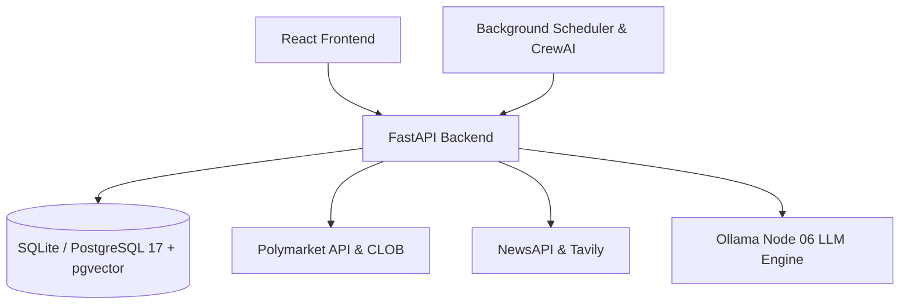

# Polymarket Intelligence

Real-time Polymarket trading intelligence platform with sports momentum analysis, weather mispricing detection, whale tracking, and AI-powered market debate.


## Architecture

```
Node 06 (16GB)                    Server 7 (8GB)
─────────────────────             ────────────────────────
CrewAI Pipeline                   PostgreSQL 17 + pgai
  Recency Analyst                   sports_teams
  Vector Librarian    ──embed──►    sports_recency_splits
                                    pgvector embeddings
Ollama                            
  qwen3-embedding:4b ◄──pgai────   FastAPI Backend
  deepseek-r1                       /api/scanners/*
  qwen2.5:7b                      Caddy (TLS)
```

See [SERVERS.md](SERVERS.md) for full infrastructure details.

## Sports Intelligence Pipeline

The CrewAI pipeline (`polymarket-pipeline` repo) runs on Node 06 and ingests live data from ESPN and MLB Stats API across all three major sports:

- **MLB** — 30 teams, rolling 3-game batting/run momentum vs season record
- **NFL** — 32 teams, rolling 3-game scoring margin vs season point differential
- **NBA** — 30 teams, rolling 5-game scoring margin vs season point differential

### Regime Tags
| Tag | Signal |
|---|---|
| `UNDERDOG SURGE 🔥` | Sub-.400 team outperforming season record recently |
| `COASTING FAVORITE ⚠️` | High win-pct team underperforming recently |
| `PEAK CONTENDER ⚡` | Top team playing at or above season form |
| `COLD CELLAR ❄️` | Bottom team with no recency improvement |

### Pipeline Flow
1. Fetch standings + recency from ESPN/MLB APIs (concurrent, all 3 sports)
2. Compute momentum scores for all 92 teams
3. Upsert all team rows to PostgreSQL (deterministic)
4. Flag discrepancy teams → CrewAI Analyst generates trading narratives
5. Vector Librarian embeds narratives via `ai.ollama_embed()` → pgvector

## Other Scanners

### Weather Mispricing
Compares NOAA/HRRR meteorological forecasts against Polymarket weather market prices. Surfaces temperature bracket mispricing and overcast/cloud cover edges.

`GET /api/scanners/weather` — scan all weather markets  
`GET /api/scanners/weather/matrix?city=sf` — deep-dive for any city

### Parlay Engine
Discovers correlated multi-market parlay opportunities and runs enterprise agent analysis on joint probability and causal correlation.

`GET /api/scanners/parlays` — discover candidates  
`POST /api/scanners/parlays/analyze` — agent analysis on a specific parlay

## Quick Start

### Prerequisites
- Python 3.12+, Node.js 18+, [uv](https://github.com/astral-sh/uv)
- PostgreSQL 17 with pgai + pgvector (Server 7)
- Ollama running (Node 06 or local)

### Environment
```bash
cp .env.example .env
# Required: POLYMARKET_API_KEY, POLYMARKET_SECRET, POLYMARKET_PASSPHRASE
# Required: GEMINI_API_KEY, TAVILY_API_KEY
# Required: DATABASE_URL (PostgreSQL), OLLAMA_BASE_URL
```

### Start
```bash
./scripts/start.sh          # both backend + frontend
./scripts/start_backend.sh  # backend only (port 8000)
./scripts/start_frontend.sh # frontend only (port 5173)
```

## Architecture & Infrastructure

Detailed distributed server topology, node specifications, IP addresses, and firewall configurations are mapped in [SERVERS.md](file:///home/wolf/polymarket-intelligence/SERVERS.md).



| Component | Cloud Host VM | Purpose |
|-----------|----------------|---------|
| **React Frontend** | Server 07 VM (`:5173`) | Single-page dashboard with Tailwind CSS, Zustand, and TradingView charts |
| **FastAPI Backend** | Server 07 VM (`:8000`) | High-performance REST API serving market data, scanner analytics, and debate agents |
| **Database Layer** | Server 07 VM (`:5432`) | PostgreSQL 17 with Timescale `pgai` and `pgvector` |
| **LLM Inference** | Node 06 VM (`:11434`) | Dedicated Ollama engine running `qwen2.5:3b`, `qwen2.5:7b`, `deepseek-r1`, and `qwen3-embedding:4b` |
| **Edge Ingress** | Server 07 VM (`:80`, `:443`) | Reverse proxy with TLS at `https://polymarket.complexsimplicity-ai.com` |

> [!NOTE]
> All runtime services, APIs, databases, and LLM instances run **100% on the remote cloud VMs**. Local development machines (Ubuntu WSL / Windows IDE) are strictly thin clients for code editing and git staging.

See [SERVERS.md](file:///home/wolf/polymarket-intelligence/SERVERS.md) for the complete cloud VM inventory, network routing, and Swarm commands.

## Configuration

| Variable | Description | Default |
|----------|-------------|---------|
| `NEWS_API_KEY` | API key from [NewsAPI](https://newsapi.org) | Required |
| `DATABASE_URL` | SQLite connection string | `sqlite+aiosqlite:///./polymarket.db` |
| `CORS_ORIGINS` | Allowed frontend origins | `http://localhost:5173` |
| `HOST` | Backend server host | `0.0.0.0` |
| `PORT` | Backend server port | `8000` |
| `DEBUG` | Enable debug mode | `true` |
| `POLYMARKET_API_KEY` | Polymarket API Key | Required for trading/auth |
| `POLYMARKET_SECRET` | Polymarket API Secret | Required for trading/auth |
| `POLYMARKET_PASSPHRASE`| Polymarket API Passphrase | Required for trading/auth |
| `GEMINI_API_KEY` | Google Gemini API Key | Required for AI Debate |
| `TAVILY_API_KEY` | Tavily Search API Key | Required for AI Debate |
## API Reference

### Sports Scanners
| Endpoint | Description |
|---|---|
| `GET /api/scanners/mlb/board` | All 30 MLB teams by momentum |
| `GET /api/scanners/mlb/team/{id}` | MLB team deep-dive |
| `GET /api/scanners/nfl/board` | All 32 NFL teams by momentum |
| `GET /api/scanners/nfl/team/{id}` | NFL team deep-dive |
| `GET /api/scanners/nba/board` | All 30 NBA teams by momentum |
| `GET /api/scanners/nba/team/{id}` | NBA team deep-dive |

### Markets
| Endpoint | Description |
|---|---|
| `GET /api/markets/top50` | Top 100 markets by 7-day volume |
| `GET /api/markets/{id}` | Single market details |
| `GET /api/markets/{id}/history` | Price history |
| `GET /api/markets/{id}/trades` | Whale orders |
| `GET /api/markets/{id}/holders` | Top holders with PnL/ROI |

## Tech Stack

| Layer | Technology |
|---|---|
| Backend | FastAPI, Python 3.12, asyncpg |
| Frontend | React 18, TypeScript, Vite, Tailwind CSS |
| Database | PostgreSQL 17, pgai, pgvector |
| Pipeline | CrewAI 1.15, Ollama, qwen3-embedding:4b |
| Infra | Tailscale mesh, Caddy, Docker, UpCloud VPS |
