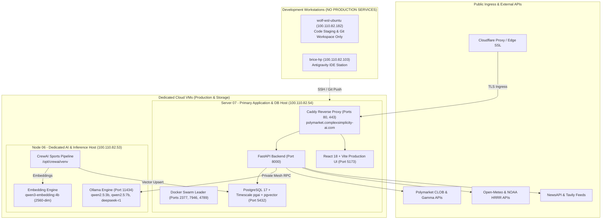

# Distributed Infrastructure & Cloud VM Architecture

System topology, cloud VM specifications, network routing, and deployment architecture for the Polymarket Intelligence platform.

## Core Architectural Principle: 100% Cloud VM Execution

> [!IMPORTANT]
> **All production services, APIs, databases, AI pipelines, and reverse proxies run exclusively on remote cloud VMs.**
> Local workstations (`wolf-wsl-ubuntu`, `brice-hp`) are strictly thin clients used for code staging, editing, and git commits. No persistent production services or databases run locally.

---

## Architecture Topology



---

## Production Cloud VMs

The platform infrastructure consists strictly of two dedicated cloud VMs connected over the private Tailscale mesh (`100.64.0.0/10`):

| VM Identifier | Tailscale IP | Specifications | Operating Role | Services Hosted |
|:---|:---|:---|:---|:---|
| **Server 07** | `100.110.82.54` | 4 vCPU, 8 GB RAM (UpCloud Chicago) | **Swarm Leader, Database, API & Ingress Host** | Caddy (`80`/`443`), FastAPI (`8000`), React UI (`5173`), PostgreSQL 17 (`5432`), Swarm Leader (`2377`), Caddy Admin (`2019`) |
| **Node 06** | `100.110.82.53` | 4 vCPU, 16 GB RAM (UpCloud) | **AI Inference, Vector Generation & Pipeline Host** | Ollama Engine (`11434`), Docker Engine (`2375`), CrewAI Sports Pipeline (`/opt/crewai/venv`) |

---

## Development Workstations (Non-Production)

These machines do **not** run persistent production services or databases:

| Machine Name | Tailscale IP | Operating System | Role |
|:---|:---|:---|:---|
| **`wolf-wsl-ubuntu`** | `100.110.82.182` | Ubuntu (WSL2) | Local development, code editing, and git staging workspace. Primary SSH bridge for mesh commands. |
| **`brice-hp`** | `100.110.82.103` | Windows 11 | Host station running Antigravity IDE. |

---

## Cloud VM Workloads & Specifications

### 1. Server 07 (`100.110.82.54`) - Primary Application & Database Host

Server 07 is the central orchestrator, ingress, and persistence node:

- **Reverse Proxy & Ingress**:
  - Live Domain: `https://polymarket.complexsimplicity-ai.com`
  - Caddy terminates Let's Encrypt TLS on ports `80` and `443` and routes internally.
  - Caddy Admin API bound to `100.110.82.54:2019` over Tailscale.
- **Application Services**:
  - `FastAPI Backend`: Runs on port `8000`.
  - `React Frontend`: Production SPA served via Vite/Nginx on port `5173`.
- **Database Engine (PostgreSQL 17 + Timescale pgai + pgvector)**:
  - Port `5432`.
  - Database: `postgres`.
  - Schemas & Tables:
    - `sports_teams`: `PRIMARY KEY (sport, team_id)` — Standings, records, and run differentials for MLB (30), NFL (32), NBA (30).
    - `sports_recency_splits`: `UNIQUE (sport, team_id, date_recorded)` — 3-game and 5-game rolling momentum scores.
    - `sports_intelligence_memory`: 2560-dimension semantic vector memories embedded via `ai.ollama_embed()` pointing to Node 06 (`100.110.82.53:11434`).
    - `markets` & `news_articles`: Polymarket market cache and aggregated news.
- **Docker Swarm Management**:
  - Primary Swarm Manager / Leader (Engine 29.8.1).
  - Swarm Control Plane: Port `2377/tcp`.
  - Node Gossip: Port `7946/tcp,udp`.
  - Overlay VXLAN: Port `4789/udp`.
- **Firewall & Security**:
  - UFW restricts public WAN traffic (`152.44.40.120`) to ports `80` and `443` only.
  - All internal ports (`5432`, `2377`, `8000`, `5173`, `2019`) are restricted to the Tailscale mesh (`100.64.0.0/10`).
  - Auto-trade disabled (`AUTO_TRADE_ENABLED=False`) with zero live wallet keys mounted.

---

### 2. Node 06 (`100.110.82.53`) - Dedicated AI & LLM Inference Host

Node 06 provides compute resources for local model inference and embedding generation:

- **Ollama REST Service**: Listening on `http://100.110.82.53:11434` over the Tailscale mesh.
- **Docker Engine Daemon**: Listening on `tcp://100.110.82.53:2375` over the Tailscale mesh.
- **Preloaded & Pinned Models (`keep_alive: -1`)**:
  - `qwen3-embedding:4b`: Generates 2560-dimensional vector embeddings for market and sports intelligence memory.
  - `qwen3-embedding:0.6b`: Lightweight fallback embedding model.
  - `deepseek-r1:latest`: Deep reasoning for sequential parlay cross-validation and CrewAI agent analysis.
  - `qwen2.5:3b` / `qwen2.5:7b`: Supplementary fast evaluation and report formatting.
- **CrewAI Pipeline**:
  - Repository: `/opt/crewai/polymarket-pipeline`
  - Environment: `/opt/crewai/venv` (CrewAI 1.15.21)
  - Pipeline Entrypoint: `/opt/crewai/polymarket-pipeline/pipeline/sports_crew_pipeline.py`
  - Flow:
    1. Fetches live standings + recency data from ESPN API (NFL/NBA) and MLB Stats API.
    2. Computes momentum scores and regime tags for all 92 teams.
    3. Upserts all team rows into Server 7's PostgreSQL deterministically.
    4. Recency Analyst agent generates trading narratives for flagged teams.
    5. Vector Librarian agent embeds narratives via pgai into Server 7 PostgreSQL.

---

## Cloud VM Port Matrix

| Port | Service | Host VM | Binding Interface | Accessible By | Purpose |
|:---|:---|:---|:---|:---|:---|
| `80/tcp` | HTTP Ingress | Server 07 | `0.0.0.0` (Public WAN) | Public Internet | ACME challenges & HTTPS redirects |
| `443/tcp` | HTTPS Ingress | Server 07 | `0.0.0.0` (Public WAN) | Public Internet | Production application traffic |
| `5173/tcp` | React UI | Server 07 | Container / `tailscale0` | Tailscale Mesh | Production dashboard interface |
| `8000/tcp` | FastAPI Backend | Server 07 | Container / `tailscale0` | Tailscale Mesh | Polymarket Intelligence REST API |
| `5432/tcp` | PostgreSQL 17 | Server 07 | `127.0.0.1` / `tailscale0` | Tailscale Mesh | Relational & vector database storage |
| `11434/tcp` | Ollama API | Node 06 | `tailscale0` | Tailscale Mesh | LLM inference & vector embeddings |
| `2375/tcp` | Docker API | Node 06 | `100.110.82.53:2375` | Tailscale Mesh | Remote Docker Engine access |
| `2019/tcp` | Caddy Admin API | Server 07 | `100.110.82.54:2019` | Tailscale Mesh Nodes | Caddy dynamic configuration & management REST API |
| `2377/tcp` | Swarm Leader | Server 07 | `tailscale0` | Swarm Cluster | Docker Swarm control plane |
| `7946/tcp,udp` | Swarm Discovery | Server 07 | `tailscale0` | Swarm Cluster | Overlay network gossip |
| `4789/udp` | Swarm Overlay | Server 07 | `tailscale0` | Swarm Cluster | Overlay network data plane |

---

## Verification Commands

### Check Swarm Status on Server 07
```bash
tailscale ssh root@100.110.82.54 "docker node ls"
```

### Check Ollama Engine on Node 06
```bash
curl http://100.110.82.53:11434/api/tags
```

### Check Docker API on Node 06
```bash
curl http://100.110.82.53:2375/version
```

### Inspect PostgreSQL Database on Server 07
```bash
tailscale ssh root@100.110.82.54 "sudo -u postgres psql -d postgres -c 'SELECT count(*) FROM sports_intelligence_memory;'"
```

### Test Production API Health on Server 07
```bash
curl http://100.110.82.54:8000/api/health
```
